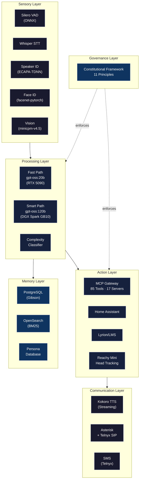

  

  <strong>Technical Solutions Architect @ Cisco</strong> · Founder, <a href="https://bfgarcia.github.io/salient-concepts/">Salient Concepts LLC</a>

---

### About

I design and build production AI systems that run entirely on local infrastructure — no cloud, no external dependencies. By day, I architect data center solutions at Cisco. By night, I build **EPOCH**: a full-stack AI nervous system platform that powers voice assistants, home automation, telephony, and robotics from hardware I own.

EPOCH isn't a prototype — it's a production platform running 24/7 with 85 tools across 17 MCP servers, real-time voice interaction, and a constitutional governance framework that enforces 11 architectural principles. Every component, from VAD to TTS, runs on local GPUs with zero data leaving the network.

---

### EPOCH Architecture

---

### By the Numbers

| Metric | Value |
|:-------|------:|
| MCP Tools | **85** |
| MCP Servers | **17** |
| Architecture Layers | **7** |
| Voice Pipeline Tools | **51** |
| Intelligence Tiers | **3** (reflexive · deliberate · deep) |
| Constitutional Principles | **11** |
| Cloud Dependencies | **0** |

---

### Tech Stack

**AI / ML**

**Infrastructure**

**Hardware**

---

### Featured Projects

<table>
<tr>
<td width="50%" valign="top">

**EPOCH**
*AI Nervous System Platform*

Production-grade AI platform modeled on a biological nervous system. 7-layer architecture with constitutional governance, 3-tier intelligence routing, and 85 MCP tools across 17 servers. Powers voice, telephony, robotics, home automation, and security intelligence — all on local infrastructure.

`python` `mcp` `ollama` `langgraph` `constitutional-ai`

</td>
<td width="50%" valign="top">

**Aria**
*Voice Assistant — Local. Private. Intelligent.*

AI voice assistant with real-time speech pipeline (VAD → STT → LLM → TTS), speaker and face recognition, phone calls and SMS, music control, and embodiment in a Reachy Mini robot. Sub-2-second voice response, 51 tools, zero cloud.

`voice-ai` `whisper` `kokoro-tts` `speaker-id` `reachy`

</td>
</tr>
<tr>
<td width="50%" valign="top">

**Sage**
*Personal Finance Dashboard*

Full-stack finance application with FastAPI backend and React/TypeScript frontend. Portfolio tracking, tax optimization, and financial planning — all self-hosted.

`fastapi` `react` `typescript` `tailwind` `postgresql`

</td>
<td width="50%" valign="top">

**[Salient Concepts](https://bfgarcia.github.io/salient-concepts/)**
*Private AI Home Automation*

Company site for Salient Concepts LLC. Building privacy-focused smart home technology where your data never leaves your network.

`salient-concepts` `privacy` `smart-home`

</td>
</tr>
</table>

---

### Principles

EPOCH is governed by a constitutional framework — 11 non-negotiable principles that guide every architectural and operational decision:

1. **Deterministic Intelligence** — Prefer rules and heuristics over probabilistic inference when outcomes must be predictable
2. **Confidence-Aware Autonomy** — Act autonomously when confidence is high; escalate to human judgment when uncertain
3. **Privacy-First Architecture** — All data processing on local infrastructure; nothing leaves the network
4. **Graceful Degradation** — Every component has a fallback; no single failure takes down the system
5. **Constitutional Governance** — Principles are enforced in code, not just documented

<strong>See all 11 principles</strong>

6. **Minimal Authority** — Each component gets only the permissions it needs
7. **Observable Operations** — Every decision is logged and auditable
8. **Human-in-the-Loop** — Critical actions require explicit human approval
9. **Additive Evolution** — New capabilities must never break existing ones
10. **Resource Awareness** — Respect compute, memory, and bandwidth constraints
11. **Honest Communication** — Never fabricate information; say "I don't know" when uncertain

---

### Connect

---

  <em>Building AI that runs where you live.</em>

